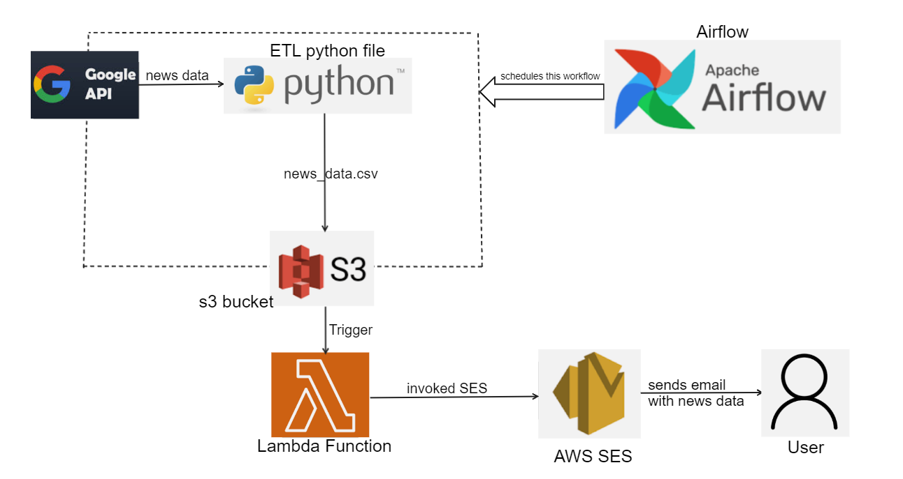
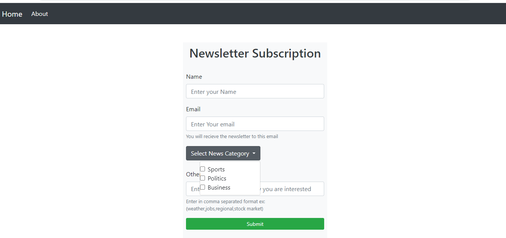
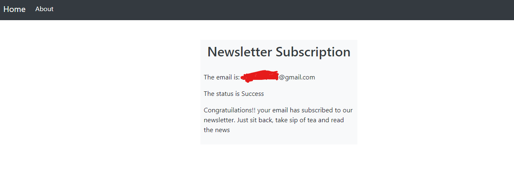

# GoogleNews_ETL-Newsletter
# ETL Data Pipeline for Collecting News Data from Google News API, Uploading to S3 and sending an email to the user.
# Overview
The goal of this project is to set up an ETL (Extract, Transform, Load) pipeline to collect news data from Google News API, upload it to an S3 bucket and send an email to the user. The pipeline is automated using Airflow, and a Lambda function is included to send an email to the user whenever new data is put into the S3 bucket.
## Sections
- [Architechture](#Architechture)
- [Prerequisites](#Prerequisites)
- [Setup](#Setup)
- [Installation](#Installation)
- [Conclusion](#Conclusion)

# Architecture

The architecture of the project consists of the following components:
* Google News API: A source of news data that provides the latest headlines from various sources around the world.
* Airflow: An open-source platform used for scheduling, monitoring, and managing workflows.
* AWS S3: A cloud-based object storage service used to store the news data.
* AWS Lambda: A serverless computing service that executes code in response to events, in this case, the addition of new data to the S3 bucket.
* AWS SES: A cloud-based email service used to send email notifications to the user.
# Setup
* Set up an AWS S3 bucket: Create an S3 bucket to store the news data.
* Set up an AWS IAM role: Create an IAM role with the necessary permissions to access S3 and SES.
* Set up an AWS Lambda function: Create a Lambda function that will send an email using SES whenever new data is put into the S3 bucket.
* Set up an Airflow DAG: Create an Airflow DAG (Directed Acyclic Graph) to schedule the ETL pipeline workflow.
* Run the ETL pipeline: Run the Airflow DAG to start the ETL pipeline, which will collect news data from the Google News API, transform it, and upload it to the S3 bucket.
* Receive email notifications: Whenever new data is added to the S3 bucket, the Lambda function will automatically invoke SES to send an email notification to the user.
# Pre-requisites
* Basic Understanding of Python 3.6 or higher
* Basic Understanding of AWS services like EC2, S3, SES, Lambda, RDS. Must have an AWS account
* Basic Understanding of Airflow 1.10.12 or higher

# Installation
* pip install requirements.txt
 
# Setup
* Create a .env file to store the DB parameters and credentials.
* Your .env file should have the following
* AWS Access key and secret key, DB hostname, DB name, Admin username and password.
### Set up RDS Database.
* Go to RDS and create a database.
* Provide database name, admin credetials and make it publicly accessible(Not recommended for production)
* Once the database is created, copy the hostname/endpoint and store it in .env file along with database name and admin credentials.

### Run the Flask app.
* Clone this repo and run application.py file.
* You will see a Newsletter subscription form. Enter your details and submit.

* You will receive a verification email to your inbox. Go ahead and verify your email.
* Check your status by clicking on check status button.

* Now you have successfully subscribed to the Newsletter.
* The user input data will be stored in RDS database.
* You can connect to DB using Mysql Workbench and validate.

### Set up an AWS S3 bucket
* Place it in the same region as Lambda function.
* Uncheck - block all public access option (Not recommended for Production)
* Ensure your IAM role has all EC2 and S3 access.
### Set up an AWS SES
* An identity is an email address that sends/receives the email from SES.
* Once the identity is created, verify your email address in your email inbox.
### Set up an AWS IAM role (for Lambda Function)
* Ensure your IAM role has all SES and S3 access.
### Set up an AWS Lambda function
* Use a blueprint (get s3 object).
* Use the new role created above for this lambda function that has access to SES and S3.
* Choose your S3 bucket for the trigger.
* Once the lambda function is created, create a layer for Pandas.
* Deploy the lambda.py code in aws lambda code panel after adding  the source and destination email address and also the source email address identity ARN.
* Run app.py locally. It should uplaod files to S3 bucket. This Upload event should trigger lambda function. Then the lambda function should invoke SES to send email to destination address.
* S3 --> Lambda --> SES
* To view logs of lambda, you can see it in Cloudwatch > log_groups
* If successful , you must have received an email containing news!!!!!
## Set up an Airflow DAG
### Running Airflow on ec2 Instance 
* Create an EC2 instance (OS Image - Ubuntu) of size at least t3.medium (same region as lambda function and s3)
* Allow https from internet
* Modify the security groups of the ec2 - inbound rule - add rule - new TCP rule source - my ip
* Once EC2 is running, SSH into it and run the following commands.
  * chmod 400 xxxxx.pem (Replace with the keypair name)
  * ssh -i "xxxx.pem" ubuntu@ec2-xx-xxx-xx-xxx.compute-x.amazonaws.com
  * sudo apt-get update  (downloads package info from internet)
  * sudo apt install python3-pip (Installs python)
  * Install all the dependencies of app.py using pip
  * sudo pip install pandas requests boto3 s3fs python-dotenv xmltodict
  * Now we are ready to install apache airflow
  * sudo pip install apache-airflow
  * Start the airflow using
  * airflow (Run this command to validate the airflow installation)
  * airflow db init (Instantiates the Airflow's metastore)
  * Create a user using following command.
  * airflow users create --username admin --password admin --role Admin --firstname first --lastname last --email sample@gmail.com
  * Make sure to run webserver and scheduler in 2 different terminals.
  * airflow webserver (Start the Airflow's webserver)
  * airflow scheduler (Start the Airflow's scheduler)
  * Now open the Public DNS of the ec2 at port 8080. You should land on the airflow login page.
  * Login with user credentials(created above). You can see the default dags in the home page. Now we need to add our own dag into this.
  * Open a new terminal (webserver and scheduler should be running in background in previous terminals)
  * ls -  you will find airflow directory
  * cd airflow - 
  * mkdir dags - create a directory where we can keep our code.
  * cd dags
  * Clone the repo here
  * Add .env file containing the aws secrets and RDS database details.
  * cd ..
  * sudo nano airflow.cfg - You can see the below line to set the working directory that contains the dag file
  * dags_folder = /home/ubuntu/airflow/**dags**
  * Refresh the airflow page and you should be able to see your dag
  * Open the dag and trigger it.
  * Once airflow dag is running and scheduled we will be getting emails after every interval.

# Conclusion
This project demonstrates how to set up an automated ETL pipeline to collect news data from Google News and upload it to an S3 bucket. By using Airflow to schedule the pipeline and AWS Lambda to send email notifications, the workflow can be fully automated and require minimal manual intervention.

